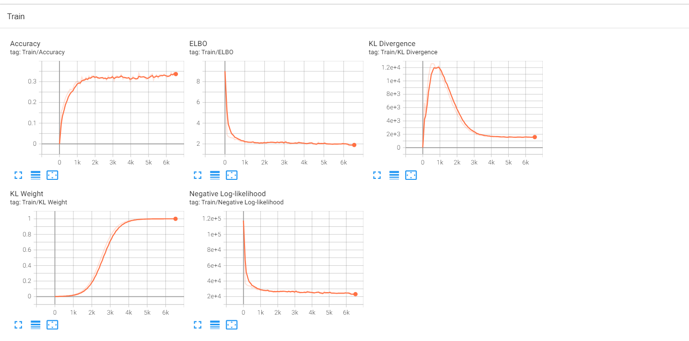
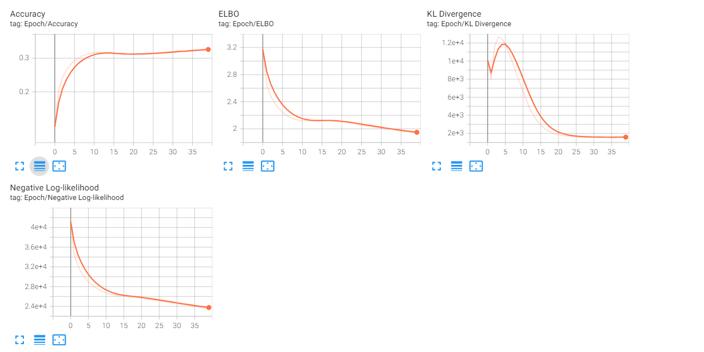
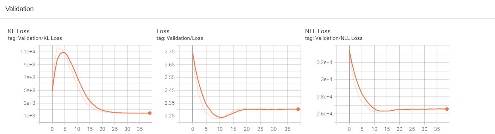

# Sentence VAE Project

This repository is a re-implementation of the methodology presented in the paper [Generating Sentences from a Continuous Space](https://arxiv.org/abs/1511.06349). The paper describes how sentences can be mapped into a latent space and reconstructed deterministically, enabling the generation of coherent sentences and smooth interpolations between sentences. 

*The implementation is inspired by [Tim Baumgärtner's repository](https://github.com/timbmg/Sentence-VAE), with several data processing scripts and helper functions adapted from there. This project primarily serves as a learning exercise to deepen understanding of Variational Autoencoders (VAEs).*

## Project Outcomes

### Performance Metrics

#### Training Performance


#### Per Epoch Performance


#### Validation Performance



## Installation

To set up the project, follow these steps:

1. **Clone the repository**:
    ```bash
    git clone https://github.com/Etelis/Sentences-from-a-Continuous-Space.git
    cd SentenceFromSpace
    ```

2. **Install dependencies**:
    ```bash
    pip install .
    ```

### Generated Sentences

Here are some examples of sentences generated by sampling from the latent space (z ~ N(0, I)):

```
<sos> the company 's N N stake in the < unk > <eos>
<sos> a year ago he said the company 's earnings growth <eos>
<sos> first boston 's N N is a share of the company <eos>
<sos> for example the company 's N N N N N <eos>
<sos> to be a < unk > of the stock market <eos>
```

### Sentence Interpolation

The sentences below were generated by interpolating between two latent vectors:

```
<sos> i ' m not going to be a disaster <eos>
<sos> i think the fed is n't committed to the disaster <eos>
<sos> osha said the contract signed a definitive agreement with the facility and a new york facility in the netherlands <eos>
<sos> we do n't want to see the reduction in the next few months <eos>
<sos> researchers said the ordinance is slated to be introduced by the virus <eos>
```

## Training the Model

To train the Sentence VAE model, you need to first obtain the Penn Treebank dataset. Use the provided `download_data.sh` script for this.

You can start training the model by running:

```bash
train_sentence_model --model_config configs/model_config.yaml --training_config configs/training_config.yaml --data_dir raw_data

```

### Training Configuration

The training process can be customized with various arguments:

- `--learning_rate`: Sets the learning rate for the optimizer.
- `--num_layers`: Specifies the number of LSTM layers in the model.
- `--word_dropout_rate`: Sets the dropout rate applied to words during training.
- `--annealing_till`: Defines the number of steps over which the KL weight annealing occurs.

For a full list of configurable options, refer to the [train.py](train.py) file.

## Inference with the Model

To generate sentences using a trained model, execute:

```bash
predict_sentence_model --model_config configs/model_config.yaml --inference_config configs/inference_config.yaml --model_path logs/best_model.pt --output_file generated_sentences.txt
```

### Inference Configuration

Inference can be configured with several parameters:

- `--model_path`: Path to the saved model checkpoint.
- `--beam_width`: Sets the width of the beam search (if using beam search).
- `--use_beam_search`: Enables beam search for sentence generation.
- `--output_file`: Specifies the file to save generated sentences.

These options and others can be adjusted as needed. Detailed configurations can be found in the provided [inference.py](inference.py) file.

## Configuration Files

### Model Configuration (`configs/model_config.yaml`)

```yaml
embedding_dim: 300          # Size of word embeddings
hidden_dim: 256             # LSTM hidden state size
word_dropout_rate: 0.5      # Dropout rate applied to words
embedding_dropout_rate: 0.1 # Dropout rate for embeddings
latent_dim: 64              # Dimensionality of the latent space
max_gen_len: 50             # Maximum length of generated sentences
bidirectional: false        # Use bidirectional LSTMs
num_layers: 2               # Number of LSTM layers
```

### Training Configuration (`configs/training_config.yaml`)

```yaml
batch_size: 8              # Training batch size
learning_rate: 0.001       # Learning rate
epochs: 10                 # Number of epochs for training
log_interval: 100          # Interval for logging training metrics
log_dir: "logs"            # Directory for saving logs
anneal_function: "logistic"# Annealing function type for KL weight
k: 0.0025                  # 'k' parameter for the annealing function
annealing_till: 2500       # Number of steps to complete annealing
```

### Inference Configuration (`configs/inference_config.yaml`)

```yaml
num_sentences: 1           # Number of sentences to generate
beam_width: 5              # Width of beam search
device: "cuda"             # Device to use (e.g., "cpu" or "cuda")
output_file: "generated_sentences.txt" # File to save generated sentences
data_dir: "data"           # Directory containing data
model_path: "logs/best_model.pt" # Path to the saved model
n_samples: 20              # Number of samples to generate
```

## Beam Search Implementation

We have incorporated a beam search mechanism for sentence generation. This feature enhances the quality of generated sentences by exploring multiple potential sentence paths and selecting the most likely sequences. The beam width can be adjusted through the `--beam_width` argument in the inference configuration.

## Testing

Unit tests are provided to ensure the functionality of different components. These tests are located in the `tests` directory and cover configurations, data handling, inference, models, training, and utility functions.

